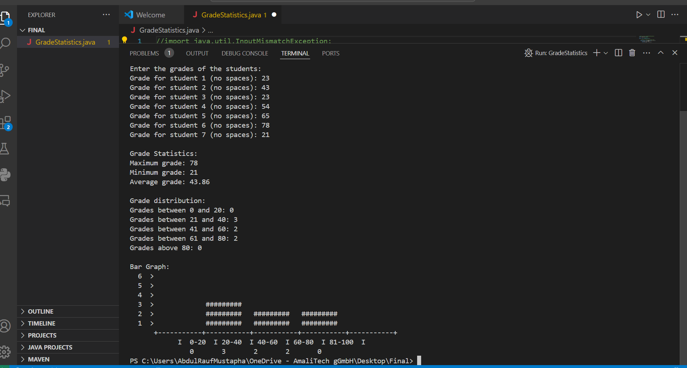

# Grade Statistics
The **Grade Statistics** program is a Java console application that helps users analyze student grades. It prompts users to input the number of students and their respective grades, ensuring that all inputs are valid and contain no spaces. The program calculates the maximum, minimum, and average grades, categorizes scores into predefined ranges, and displays the results.

Additionally, the program visualizes the distribution of grades using an ASCII bar graph, making it easy to see how scores are spread across different intervals. This tool is ideal for quickly assessing grade statistics and understanding performance trends in a simple and interactive manner.

## Screenshots

#### This shows the screenshot of my sample inputs and its corresponding output. 